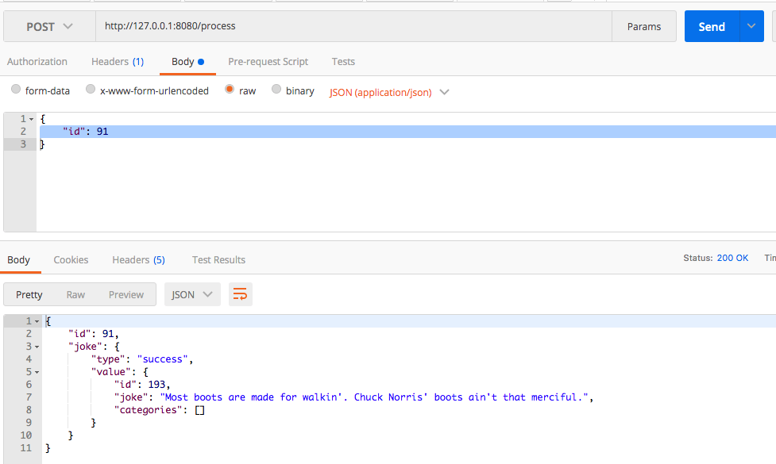

# Kafka Synchronous Service

Projeto em spring boot para executar requisições síncronas

## Composiçao do projeto
- Spring Boot (spring web, spring kafka e devtools)
- Três containers Docker contendo:
    - zookeeper
    - kafka
    - kafka-sync-service (aplicação cliente que faz a integração entre as requisições rest e as mensagens do kafka)

## Requisitos
Possuir o [docker](https://docs.docker.com/get-docker/) instalado

## Rodando o projeto

Para rodar o projeto é necessário necessário gerar o jar, com o comando package do maven e, executar o seguinte comando:

```
docker-compose up
```

## Executando o teste
Para executar o teste, basta seguir o passado a passo:
- enviar uma requisição do tipo POST, para o endereço http://127.0.0.1:8080/process
- o body é opcional, podendo ser enviado sem parâmetros ou com um campo "id", o qual aparecerá no console

Abaixo a requisição disparada no postman com o retorno:



## Producer e Listener 
O projeto é basicamente composto de um serviço rest, disponível no path /process, e um listener o qual fica consumindo o tópico configurado no arquivo application.yml.